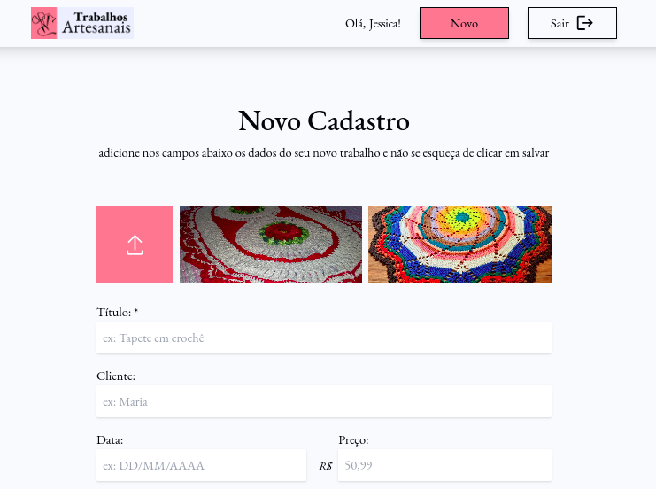

# Trabalhos Artesanais

[Português]
O Trabalhos Artesanais é um projeto com o objetivo de facilitar a administração de vendas, funcionando como um caderno online. Os usuários podem cadastrar seus trabalhos com as respectivas informações de forma intuitiva, permitindo um controle e histórico mais eficazes.

[English]
Trabalhos Artesanais is a project to facilitate sales management that works like an online notebook. Users can intuitively enter their works with the relevant information, allowing for more efficient control and record-keeping.

## Getting Started
Para começar no Booking Room API, siga estes passos:

1. Clonar o repositório: **`git clone https://github.com/jessicasantosb/trabalhos-artesanais.git`**
2. Entrar na pasta do projeto: **`cd trabalhos-artesanais`**
3. Instalar as dependências: **`yarn`**
4. Iniciar o aplicativo: **`yarn dev`**

## Live Demo

[Português]
Confira a demonstração ao vivo

[English]
Check out the live demo

[Live Preview](https://trabalhos-artesanais.vercel.app/)

## Screenshot

## Technology Stack

- React
- Typescript
- Tailwind
- Firebase

## Author

Created by Jessica Bandeira.

- LinkedIn: [Jessica's LinkedIn Profile](https://www.linkedin.com/in/jessicasantosb/)

## Known Issues and Future Improvements

[Português]

- Mencione quaisquer problemas conhecidos ou limitações.
- Esboce seus planos para melhorias futuras.

[English]

- Mention any known issues or limitations.
- Outline your plans for future improvements.