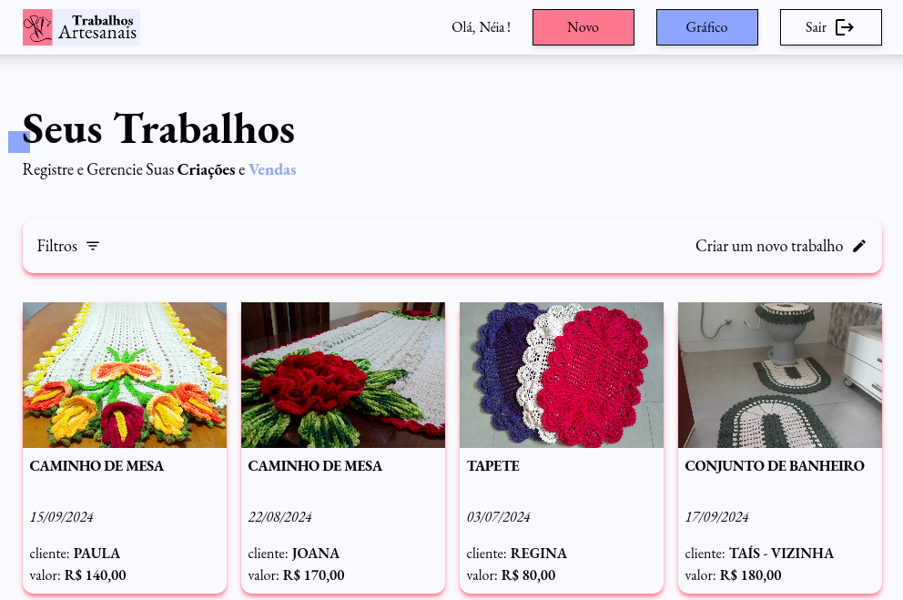

<p align="center">
  
  
  
</p>
<h1 align="center">Trabalhos Artesanais</h1>
<p align="center">
  Este projeto <code>fullstack</code> foi desenvolvido em React, Typescript e Firebase
</p>

---

## 📍 Visão Geral

**_Objetivo_**

Desenvolvi o projeto
<a href="https://trabalhos-artesanais.vercel.app/"> Trabalhos Artesanais </a>
com a finalidade de otimizar a gestão de vendas, funcionando como um caderno online. Os usuários podem cadastrar seus trabalhos de maneira intuitiva, permitindo um controle mais eficiente e um histórico completo das suas vendas.

**_Motivação_**

Minha motivação foi criar uma ferramenta que ajude as pessoas a organizarem suas vendas de forma prática. Queria desenvolver uma aplicação simples e acessível, onde os usuários pudessem visualizar facilmente suas anotações e fotos dos trabalhos.

<div align="center" >
  
</div>

---

## 🧬 Funcionalidades

- Autenticação de usuários via e-mail e senha.
- Armazenamento seguro de informações e imagens no banco de dados.
- Filtros de busca por título, cor ou ano.
- Testes de código para garantir a qualidade do sistema.

---

## 🚀 Começando

### ⚙️ Instalação

#### [](https://github.com/jessicasantosb/trabalhos-artesanais)

```sh
❯ git clone git@github.com:jessicasantosb/trabalhos-artesanais.git
```

```sh
❯ cd trabalhos-artesanais
```

```sh
❯ yarn
```

```sh
❯ yarn dev
```

---

### 🧪 Teste Unitário

#### [](https://github.com/jessicasantosb/trabalhos-artesanais)

```sh
❯ yarn test
```

---

## 💻 Tecnologias

- Typescript
- React
- Firebase
- Tailwind
- Jest
- Eslint

---

## 🤝 Contribuições

- 🔰 Mencione quaisquer problemas conhecidos ou limitações.
- 🐛 Esboce seus planos para melhorias futuras.
